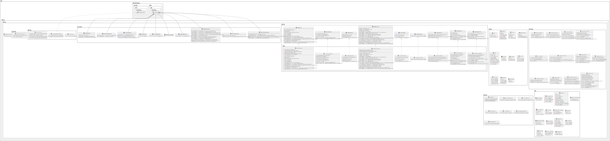

# 📚 Library-SpringMVC

<div align="center">

 <!-- Visual representation of the project's structure -->

[](https://github.com/SpyrosMitsis/Library-SpringMVC/stargazers)
[](https://github.com/SpyrosMitsis/Library-SpringMVC/network)
[](https://github.com/SpyrosMitsis/Library-SpringMVC/issues)
[](LICENSE) <!-- TODO: Add a LICENSE file -->

**A comprehensive web-based library management system built with Spring MVC and Hibernate.**

</div>

## 📖 Overview

This project implements a robust Library Management System, providing a web interface for managing books, users, and borrowing operations. Developed using the classic Spring MVC framework with Hibernate for ORM, it offers a solid foundation for educational or small-scale library applications. The system focuses on demonstrating core CRUD functionalities and the integration of Spring MVC with a relational database.

## ✨ Features

-   🎯 **Book Management**: Add, view, edit, and delete book records (titles, authors, genres, ISBNs, availability).
-   👤 **User Management**: Register new users, view user details, and manage user accounts.
-   借りる **Loan Management**: Functionality to borrow and return books, tracking loan history and current status.
-   🔎 **Search & Filter**: Efficiently search for books and users based on various criteria.
-   🔐 **Authentication**: Secure user login to access system functionalities.
-   🔄 **Database Persistence**: Robust data storage and retrieval using MySQL, managed by Hibernate.
-   🧑‍💻 **Modular Architecture**: Clean separation of concerns with Controller, Service, and Repository layers.


## 🛠️ Tech Stack

**Backend:**


**Database:**


**Build Tool:**


**Frontend (Server-side rendering):**


## 🚀 Quick Start

Follow these steps to get the Library-SpringMVC application up and running on your local machine.

### Prerequisites

Before you begin, ensure you have the following installed:

-   **Java Development Kit (JDK)**: Version 8 or higher.
-   **Apache Maven**: Version 3.6.0 or higher (or use the included Maven Wrapper).
-   **MySQL Server**: Version 5.7 or higher.
-   **Servlet Container**: Apache Tomcat 9 or higher (or similar container to deploy the WAR file).

### Installation

1.  **Clone the repository**
    ```bash
    git clone https://github.com/SpyrosMitsis/Library-SpringMVC.git
    cd Library-SpringMVC
    ```

2.  **Database Setup**

    *   Create a MySQL database, for example, `library_db`.
    *   Import the provided SQL dump to initialize the database schema and populate it with sample data:
        ```bash
        mysql -u your_mysql_username -p library_db < sql_dump.sql
        ```
        (You will be prompted for your MySQL password)

3.  **Configure Database Connection**

    *   Navigate to `src/main/resources/`.
    *   Locate or create a file named `db.properties` (or similar, depending on the project's Spring configuration).
    *   Update the database connection details with your MySQL credentials:
        ```properties
        jdbc.driverClassName=com.mysql.cj.jdbc.Driver
        jdbc.url=jdbc:mysql://localhost:3306/library_db?useSSL=false&serverTimezone=UTC
        jdbc.username=your_mysql_username
        jdbc.password=your_mysql_password

        hibernate.dialect=org.hibernate.dialect.MySQL8Dialect # Adjust for your MySQL version
        hibernate.show_sql=true
        hibernate.hbm2ddl.auto=update # Use 'validate' or 'none' for production
        ```
    *   If using an XML configuration, locate `src/main/webapp/WEB-INF/spring/root-context.xml` or similar and update the `<jdbc:property-placeholder>` or `<bean class="org.apache.commons.dbcp.BasicDataSource">` accordingly.

4.  **Build the Project**

    Use Maven to compile the project and package it into a WAR file.
    ```bash
    ./mvnw clean install
    ```
    (On Windows, use `mvnw.cmd clean install`)

    This will generate a `Library-SpringMVC.war` file in the `target/` directory.

5.  **Deploy to Servlet Container**

    *   Copy the `Library-SpringMVC.war` file from the `target/` directory to the `webapps/` directory of your Apache Tomcat installation.
    *   Start your Tomcat server. Tomcat will automatically deploy the WAR file.

6.  **Open your browser**
    Once Tomcat is running, open your web browser and visit:
    `http://localhost:8080/Library-SpringMVC/` (The context path might vary depending on your Tomcat configuration and WAR file name.)

    **Default credentials (from `users.md` and `sql_dump.sql` if present):**
    <!-- TODO: Add actual default credentials if found in sql_dump.sql or users.md -->
    - **Admin Username:** `admin`
    - **Admin Password:** `password`

## 📁 Project Structure

```
Library-SpringMVC/
├── .gitattributes
├── .gitignore
├── .mvn/                # Maven wrapper configuration files
├── diagram.svg          # Architectural diagram (SVG format)
├── digram.puml          # PlantUML source for the architectural diagram
├── mvnw                 # Maven Wrapper script (for Unix-like systems)
├── mvnw.cmd             # Maven Wrapper script (for Windows)
├── pom.xml              # Maven Project Object Model file
├── sql_dump.sql         # MySQL database schema and initial data dump
├── src/
│   ├── main/
│   │   ├── java/        # Java source code for business logic (controllers, services, entities, repositories)
│   │   │   └── com/
│   │   │       └── library/
│   │   │           └── ... (package structure for models, services, controllers)
│   │   ├── resources/   # Application resources (e.g., db.properties, logback.xml, Spring configurations)
│   │   └── webapp/      # Web application root (JSP views, static assets, WEB-INF)
│   │       ├── WEB-INF/
│   │       │   ├── views/ # JSP files for rendering UI
│   │       │   └── spring/ # Spring XML configurations (e.g., servlet-context.xml, root-context.xml)
│   │       └── resources/ # Static assets (CSS, JavaScript, images)
│   └── test/
│       └── java/        # Java unit and integration test source code
└── users.md             # Notes or documentation about system users or roles
```

## ⚙️ Configuration

### Database Configuration
The database connection details are typically managed in a properties file (e.g., `src/main/resources/db.properties`) or within Spring XML configuration files (e.g., `src/main/webapp/WEB-INF/spring/root-context.xml` or `servlet-context.xml`).

You may need to adjust:
-   `jdbc.url`: Your MySQL server address and database name.
-   `jdbc.username`: Your MySQL database username.
-   `jdbc.password`: Your MySQL database password.
-   `hibernate.dialect`: Ensure it matches your specific MySQL version (e.g., `MySQL8Dialect`).

### Spring Configuration Files
-   `src/main/webapp/WEB-INF/spring/root-context.xml`: Defines beans that are shared across the application context (e.g., data source, Hibernate session factory).
-   `src/main/webapp/WEB-INF/spring/servlet-context.xml`: Configures Spring MVC components (e.g., view resolvers, controllers, interceptors).
-   `src/main/webapp/WEB-INF/web.xml`: The deployment descriptor for the web application, configuring servlets, filters, and listeners.

## 🔧 Development

### Available Maven Commands

| Command                     | Description                                    |
| :-------------------------- | :--------------------------------------------- |
| `./mvnw clean`              | Cleans the build directory.                    |
| `./mvnw compile`            | Compiles the source code.                      |
| `./mvnw install`            | Compiles, tests, and installs the WAR/JAR into the local Maven repository. |
| `./mvnw package`            | Compiles, tests, and packages the code into a WAR file. |
| `./mvnw dependency:tree`    | Displays the project's dependency tree.        |
| `./mvnw tomcat7:run`        | (If Tomcat plugin configured) Runs the application directly on an embedded Tomcat. |
| `./mvnw jetty:run`          | (If Jetty plugin configured) Runs the application directly on an embedded Jetty. |

### Development Workflow

1.  Make changes to the Java source files (`.java`), JSP files (`.jsp`), or resource files.
2.  Rebuild the project using `./mvnw clean install` to update the WAR file.
3.  Redeploy the updated `Library-SpringMVC.war` to your servlet container (e.g., Tomcat) by replacing the old one and restarting the server, or use an embedded server command if configured.

## 🧪 Testing

This project typically uses JUnit for unit testing and potentially Mockito for mocking dependencies. Test files are located in `src/test/java/`.

To run tests:
```bash
./mvnw test
```

## 🚀 Deployment

The standard deployment method for this Spring MVC application is to package it as a `WAR` file and deploy it to a servlet container like Apache Tomcat.

### Production Build
To create a production-ready WAR file:
```bash
./mvnw clean package
```
The `Library-SpringMVC.war` file will be generated in the `target/` directory. This file can then be deployed to any compatible Java servlet container.

### Deployment Options
-   **Apache Tomcat**: The most common way is to copy the generated `.war` file to the `webapps` directory of your Tomcat installation and start/restart Tomcat.
-   **Other Servlet Containers**: Deploy the `.war` file to any other Java EE compatible servlet container (e.g., Jetty, WildFly, GlassFish) following their respective deployment procedures.

## 🤝 Contributing

We welcome contributions to enhance this Library Management System! If you wish to contribute, please follow these steps:

1.  Fork the repository.
2.  Create a new branch (`git checkout -b feature/your-feature-name`).
3.  Make your changes.
4.  Commit your changes (`git commit -am 'feat: Add new feature'`).
5.  Push to the branch (`git push origin feature/your-feature-name`).
6.  Create a new Pull Request.

Please ensure your code adheres to standard Java coding conventions and includes appropriate tests if applicable.
